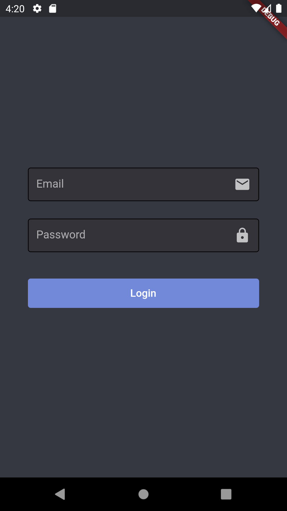

# discord_form_flutter

A simple, clean designed form. Similar to Discord's. ⚡




## Getting Started

### Add this to your package's pubspec.yaml file:

```yaml
dependencies:
  discord_form_flutter: ^0.0.1
```

### Import the package

```dart
import 'package:discord_form_flutter/discord_form_flutter.dart';
```

## How to Use

Call the `DiscordForm` widget and pass the reqiured parameters.
You can use it as a complete page. ✔

```
final _emailController = TextEditingController();
final _formKey = GlobalKey<FormState>();

@override
Widget build(BuildContext context) {
  return MaterialApp(
    home: DiscordForm(
    formKey: _formKey,
    children: [
      DiscordFormField(
        hint: 'Email',
        icon: Icon(Icons.email),
        onChanged: (value) {
              // handle textfield changes
        },
        controller: _emailController,
        ),
        SizedBox(height: 35),
        DiscordButton(
          onPressed: () {
              // handle button press
          },
          text: Text(
            'Login',
          ),
        ),
    ],
   ),
  );
}
```

## Example

You can find an example [here](https://github.com/AymanProjects/discord_form_flutter/blob/master/example/lib/main.dart)

